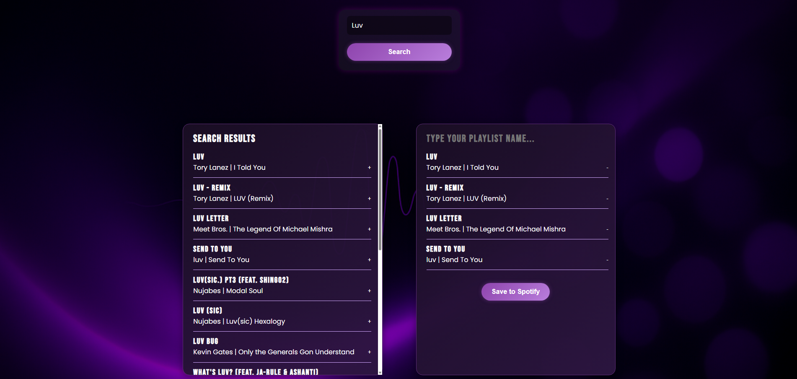

# 🎶 Jammming

Jammming is a React + Spotify web application that allows users to search for music, create custom playlists, and save them directly to their Spotify account. Built using modern React patterns and the Spotify Web API.

---

## 🚀 Features

- 🔐 Secure login using Spotify’s Authorization Code with PKCE
- 🔍 Live music search powered by the Spotify API
- ➕ Add/remove tracks to build a custom playlist
- ✏️ Rename your playlist in real time
- 💾 Save your playlist directly to your Spotify account
- ⚡ Fast frontend performance with Vite and React hooks

---

## 🛠️ Tech Stack

- **React** (with functional components and hooks)
- **Vite** (modern dev server and bundler)
- **Spotify Web API**
- **CSS Modules** (modular, scoped styling)

---

## 📦 Getting Started

### 1. Clone the repository

```bash
git clone https://github.com/yourusername/jammming.git
cd jammming
```

### 2. Install dependencies

```bash
npm install
```

### 3. Create your Spotify App

- Go to the [Spotify Developer Dashboard](https://developer.spotify.com/dashboard)
- Create a new app
- Add this **redirect URI** to your app settings:
  ```
  http://127.0.0.1:5173/
  ```

### 4. Add environment variable

Create a `.env` file in the project root and add your client ID:

```env
VITE_SPOTIFY_CLIENT_ID=your_spotify_client_id_here
```

> ⚠️ **Do not share your client ID publicly.** Make sure `.env` is listed in your `.gitignore`.

---

## ▶️ Run the App

```bash
npm run dev
```

Then open your browser to:  
**http://127.0.0.1:5173**

---

## 📸 Screenshots

### First Launch


### Playlist Builder



---

## 📄 License

This project is licensed under the [MIT License](LICENSE).

---

## 🙌 Built by

**Abdulaziz Abukar**  
You can follow or contact me on [GitHub](https://github.com/yourusername) for more awesome frontend projects!
