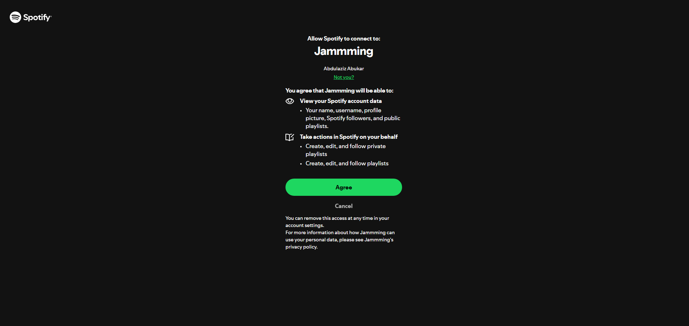

# 🎵 Jammming

Jammming is a React + Spotify web application that allows users to search for music, create custom playlists, and save them directly to their personal Spotify accounts.

## 🌐 Live Demo

**👉 Try it here:**  
[https://abdulaziz-abukar.github.io/jammming/](https://abdulaziz-abukar.github.io/jammming/)

To use the app, you'll need to log in with your Spotify account and authorize access.

---

## 💻 Running Locally

1. **Clone the repository:**

   ```bash
   git clone https://github.com/Abdulaziz-Abukar/jammming.git
   cd jammming
   ```

2. **Install dependencies:**

   ```bash
   npm install
   ```

3. **Set up environment variables:**

   Create a `.env` file in the root directory with the following:

   ```
   VITE_SPOTIFY_CLIENT_ID=your_spotify_client_id
   ```

4. **Start the development server:**

   ```bash
   npm run dev
   ```

5. Visit [http://127.0.0.1:5173/](http://127.0.0.1:5173/) to use the app locally.

---

## 📸 Screenshots

### 🔐 Spotify Authorization



### 🎧 Playlist Builder


---

## 🧠 Built With

- React
- Vite
- Spotify Web API (Authorization Code with PKCE)
- GitHub Pages

---

## 📄 Disclaimer

This project uses the Spotify Web API and is intended for educational and portfolio use only.  
It is not affiliated with or endorsed by Spotify AB.

---

## 🙌 Author

**Abdulaziz Abukar**  
[GitHub](https://github.com/Abdulaziz-Abukar)
